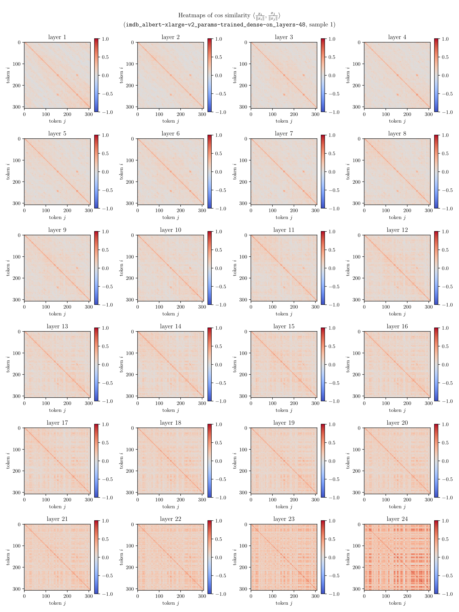
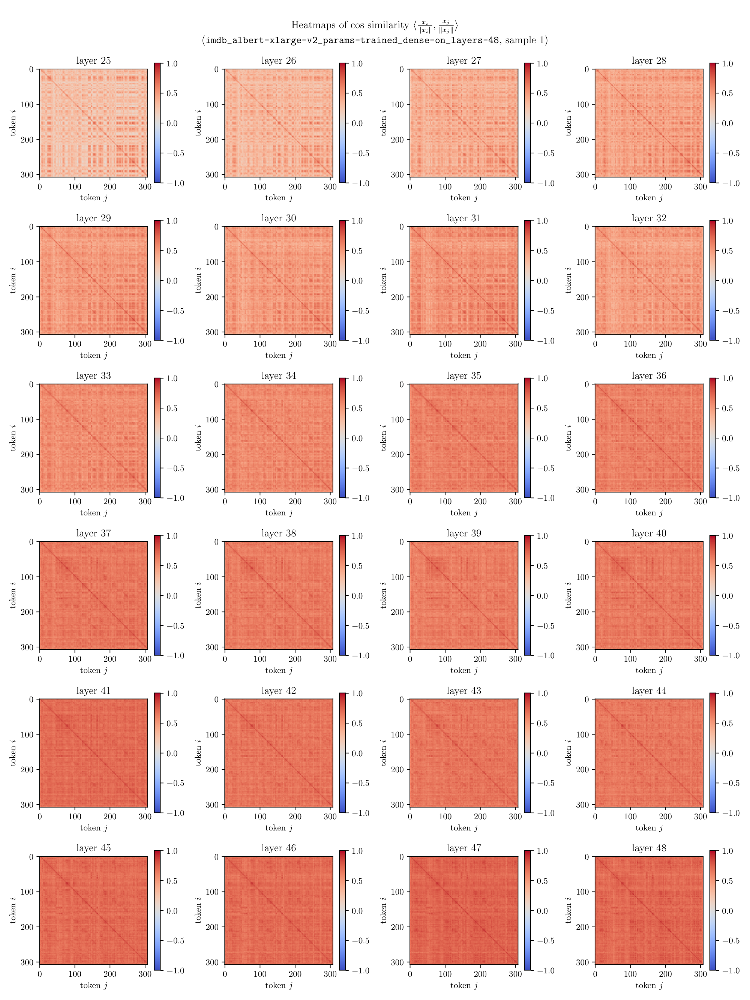

# How Transformer Speak: An Interacting Multi-Particle Perspective

The Transformer neural network architecture is a cornerstone of many modern state-of-the-art AI systems, from large language models for text generation to image segmentation for autonomous vehicles. Still, little is known about the inner working principles of Transformers and how to interpret them. We take one step towards opening the black box with a series of empirical evaluations. First, we demonstrate that in the latent space of a Transformer model the tokens cluster over time, indicating a kind of consensus dynamics. Second, we draw a connection to clustered federated consensus-based optimisation, which affords the interpretation of tokens cooperating in groups to evolve towards a consensus point that is most relevant to the group. Our work provides stepping stones for further discoveries that benefit the explainability and trustability of Transformer-based AI applications.

## Visualisations

Refer to the [report](https://kirschstein.io/files/how-transformers-speak.pdf) for more details. Example plots below.

